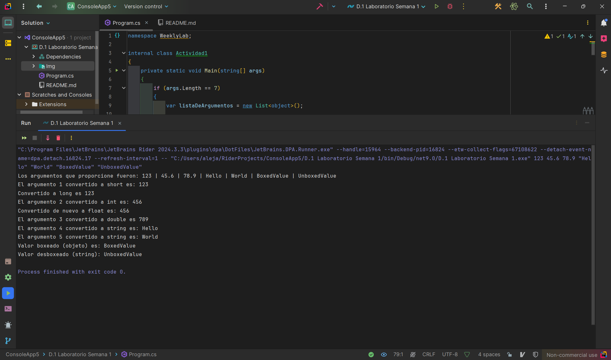

# D.1 Laboratorio Semana 1

# Mi diagrama de casos de uso sobre mi programa


### Ejemplo de entrada:
```bash
123 45.6 78.9 "Hello" "World" "BoxedValue" "UnboxedValue"
````

## ¿Qué hace mi programa?

El programa toma exactamente 7 argumentos desde la línea de comandos y realiza las siguientes acciones:

1. **Procesa y almacena los argumentos** en una lista genérica (`List<object>`), lo que me permite manipular diferentes tipos de datos.
2. **Construye un mensaje dinámico** que muestra todos los argumentos ingresados, separados por barras verticales (`|`).
3. **Convierte los argumentos** a diferentes tipos de datos según la posición:
    - El primer argumento se convierte a `short` y luego a `long`.
    - El segundo argumento se convierte a `float`, luego a `int` y de nuevo a `float`.
    - El tercer argumento se convierte a `double`.
    - El cuarto y quinto argumento se procesan como cadenas de texto (`string`).
    - El sexto argumento se trata como un objeto "encajado" (`boxed`).
    - El séptimo argumento se trata como un objeto "desencajado" (`unboxed`) de tipo `string`.

4. **Muestra los resultados de las conversiones y transformaciones** en la consola.

Si no se proporcionan los 7 argumentos, el programa muestra un mensaje indicando que no hay suficientes argumentos.

## Ejemplo del uso de mi proyecto

Para ejecutar el programa correctamente, se deben pasar los siguientes tipos de argumentos:

1. Un número que pueda convertirse a `short`.
2. Un número que pueda convertirse a `float`.
3. Un número que pueda convertirse a `double`.
4. Una cadena de texto.
5. Otra cadena de texto.
6. Un valor cualquiera para encajarlo como `object`.
7. Una cadena de texto para desencajarla como `string`.

# Ejecución de mi programa



